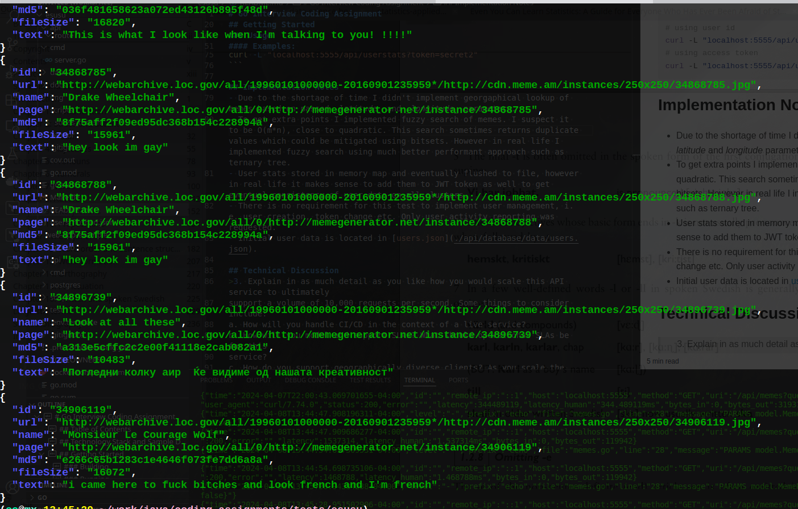

# Go Interview Coding Assignment

## Table of Contents

- [Technology Stack](#technology-stack)
- [Getting Started](#getting-started)
  - [Building](#building)
  - [Running](#running)
  - [Usage](#usage)
    - [Examples](#examples)
- [Technical Discussion](#technical-discussion)
- [Screenshot](#screenshot)


## Technology Stack and Sample Data

- HTTP web framework - [echo](https://github.com/labstack/echo)
- Free Memes Dataset from Library of Congress - [memes](./api/database/data/README.md)


## Getting Started

### Building

```bash
make all
```
will create _dist_ folder where you can find executables for macOS, linux and windows.

### Running
```bash
dist/(linux|darwin|windows)/maas <port> <users json>
```
alternative to building would be running go code directly using go _run_ command.
```bash
go run -mod vendor cmd/server.go 5555 users_flushed.json
```
default port is 8080 and, if _users_flushed.json_ is ommitted it will be created.
if you didn't use ```go mod vendor``` option then drop ```-mod vendor``` from the command above.

### Usage

List of available endpoints:

```file
GET localhost:8080/
GET localhost:8080/api/health
GET localhost:8080/api/memes
GET localhost:8080/api/userstats
```

#### Examples:
Running health end point
```bash
curl -L "localhost:5555/api/health"
# OR
curl -L "localhost:5555/"
```

Running _memes_ query
```bash
curl -L "localhost:5555/api/memes?query=becky&lon=70.225&lat=45.200" -H "X-Token:secret1" | jq .
# OR for different user
curl -L "localhost:5555/api/memes?query=paran" -H "X-Token:secret2" | jq .
```
... with fuzzy option
```bash
curl -L "localhost:5555/api/memes?query=paran&lon=70.225&lat=45.200&fuzzy=true" -H "X-Token:secret1" | jq .
```

Running _userstats_ query
```bash
# using user id
curl -L "localhost:5555/api/userstats?uid=10"
# using access token
curl -L "localhost:5555/api/userstats?token=secret2"
```

## Implementation Notes
- Due to the shortage of time I didn't implement georgaphical lookup of memes based on passed _latitude_ and _longitude_ parameters.
- To get extra points I implemented fuzzy search of memes. I suspect it to be O(m*n), close to quadratic. This search sometimes returns duplicate values which could be mitigated using bitsets. However in real life I implemented fuzzy search using much better performant approach such as ternary tree.
- User stats stored in memory map and eventually flushed to file, however in real life it makes sense to add them to JWT token as well to get eventual consistency of user data on all clusters.
- There is no requirement for this test to implement user management, i.e. user creation, token change etc. Only user activity reporting was requested.
- Initial user data is located in [users.json](./api/database/data/users.json).

## Technical Discussion
>3. Explain in as much detail as you like how you would scale this API service to ultimately
support a volume of 10,000 requests per second. Some things to consider include:
a. How will you handle CI/CD in the context of a live service?
b. How will you model and support SLAs? What should operational SLAs be for this
service?
c. How do you support geographically diverse clients? As you scale the system out
horizontally, how do you continue to keep track of tokens without slowing down
the system?

One of the ways to increase a request throuput during CI/CD cycle could be deploying and running our application inside of Kubernetes cluster configured for Horizontal Scaling using Helm Charts. Based on the resource utilization thresholds such as memory or CPU metrics we can up or down scale number of pods running our application. A _values-env.yaml_ snippet illustrates this approach.

```yaml
replicas: 4
autoScaling:
  horizontal:
    maxReplicas: 10
    averageCPU: 800m
    averageRelativeMemory: 50
```
In this case once CPU utilization reaches 800 millicores (~80%) or 50% of memory is utilized, amount of replicas is increased above original 4.


I think in case of Memes-as-a-Service an appropriate SLA would be customer-based since it would be SLA between a service provider (MaaS) and a customer.
It describes the services provided, the level of service, and the terms of the relationship.

Operational SLA might include:
 - Service and Charges
 - Parties Responsible
 - Roles and Responsibilities
 - Incident and Service Request Processing
    - Response time
    - Resolution time
    - Escalations
 - Reporting

Session consistency is one of the challenges of scaling application horizontally through different geographic locations. One of the solutions could be several session storage clusters that would sync up frequently. Needless to say these clusters would require low latency storage system something like Memcache or any other efficient in-memory storage servers. Maybe Cassandra can be utilized for this purpose too due to its distributed nature and node equality. Also end user's JWT token should be utilized as much as possible to store relevant stateful info that can by synced with every request with session storage cluster.

>4. The success of this product has led to the team adding new and exciting features which
the customers have highly requested. Specifically, we are now offering a premium
offering: Memes AI. With Memes AI, you can get even spicier memes curated by
generative AI. Naturally, this feature costs extra money and requires a separate
subscription.
Describe how you would modify the service to now keep track of whether a client is authorized
to get AI-generated memes. If a client has this subscription, then they should get AI-memes,
and they should get normal memes otherwise. How do you keep track of authorization of a
client as we cale the system without slowing down performance?

JWT token can be used to indicate subscription level for each client. Also each endpoint and each user can have their resource access permissions encoded in a bitmap (see [here](./docs/redis-bitmaps-manage-access-control.pdf)). By ADD'ing and XOR'ing these 2 bitmaps we can determine whether a user can access AI-generated memes or not. That access permission bitmap can be converted to a binary string and stored in JWT.

## Screenshot
